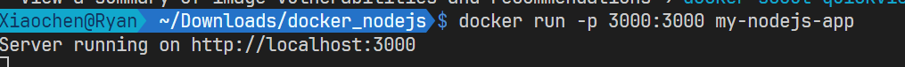
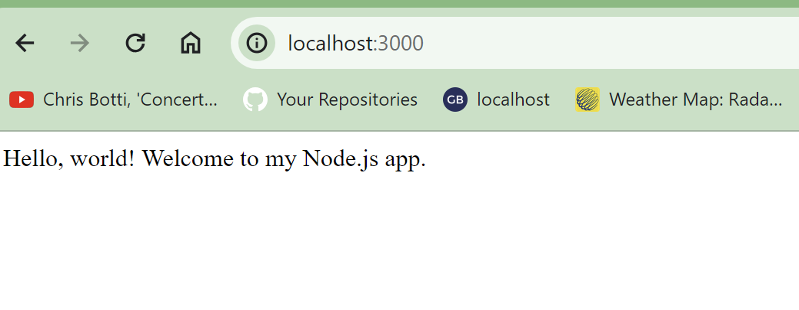

## 1. Pull the Official Node.js Image from Docker Hub
You can use the Docker CLI to pull the official Node.js image from Docker Hub. Open your terminal or command prompt and type the following command:

```bash
docker pull node
```
## 2. Build Your Docker Image
Run the following command in the same directory as your Dockerfile to build your Docker image:
```bash
docker build -t my-nodejs-app .
```

## 3. Run Your Node.js Application
After the image is built, run it with: 

docker run -p 3000:3000 my-nodejs-app
```bash
docker run -p 3000:3000 my-nodejs-app
```



## 4. Visit localhost:3000
